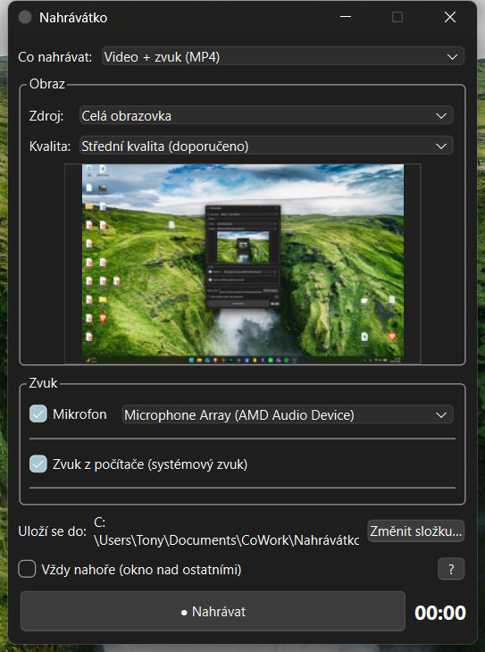

# Captaculum / Nahrávátko

📖 [Čeština](README.md) · **English**

*The app's English interface runs under the name **Captaculum** (Latin for "little capture device"); in Czech it stays **Nahrávátko**. It is one and the same application.*

**A simple, portable screen & audio recorder for Windows.**

No installation, no technical jargon. Run the `.exe`, pick what to record, click *Record*. The goal is for even a non-technical user to make their first recording within a minute.

<p align="center">
  
</p>

<p align="center">
  <a href="https://github.com/Tnlrk/Nahravatko/releases/latest/download/Nahravatko-portable.zip">
    
  </a>
  &nbsp;
  <a href="https://github.com/Tnlrk/Nahravatko/releases/latest">
    
  </a>
</p>

<p align="center">
  <b><a href="https://github.com/Tnlrk/Nahravatko/releases/latest/download/Nahravatko-portable.zip">⬇ Download the latest version (ZIP)</a></b>
  &nbsp;·&nbsp;
  <a href="https://github.com/Tnlrk/Nahravatko/releases">all releases</a>
</p>

---

## Features

- 🎥 **Video** — full screen, a specific monitor, or a specific window. Works even with hardware-accelerated windows (Chrome, Teams, Spotify, Electron/PWA apps).
- 🎙️ **Audio** — microphone and/or system sound ("what you hear from the computer"), in any combination merged into a single track.
- 🎚️ **Quality** — High / Medium / Low (one easy-to-understand control; Medium = exactly 1080p, Low = 720p).
- 🖼️ **Live preview** before recording and **volume meters** (VU) for both audio sources.
- 📦 **Two outputs** — *Video + audio* (MP4, H.264/AAC) or *Audio only* (M4A, AAC 192 kbps).
- 🧰 **Convenience** — tray icon (turns red while recording), an "Always on top" option, close-to-tray, automatic opening of the folder with the finished recording, remembered settings.
- 🌗 **Appearance & accessibility** — light and dark mode automatically per Windows settings; legible controls for low-vision users (respects Windows scaling).
- 🔔 **Update checking** — on startup it quietly checks whether a newer version is on GitHub; if so, it offers a download (nothing installs itself).
- 📁 **Saving** — recordings go straight to your **Videos** folder; the path can be changed anytime.
- 💾 **Portable** — the whole thing runs from a single folder, with no installation and no admin rights.

---

## Download & use

1. Download **[Nahravatko-portable.zip](https://github.com/Tnlrk/Nahravatko/releases/latest/download/Nahravatko-portable.zip)** and **extract** it anywhere — desktop, a folder, a USB stick.
2. Run **`Nahravatko.exe`**. (The window title shows *Captaculum* when the app runs in English.)
3. Record. Finished files are saved to your **Videos** folder (`C:\Users\…\Videos`); change the path with the *Change folder* button.

> [!IMPORTANT]
> The whole folder must stay together — `Nahravatko.exe` needs all the `.dll` files, the subfolders (`platforms`, `styles`, …) and `ffmpeg.exe` right next to it. Don't copy just the `.exe`.

**Requirements:** Windows 10 (version 1903 or newer) or Windows 11, 64-bit. Nothing else — the runtime libraries and FFmpeg are bundled.

> [!NOTE]
> On first launch Windows may show **SmartScreen** ("Windows protected your PC") — the app is not digitally signed. Click **More info → Run anyway**.

> [!TIP]
> The interface language follows your system by default. You can switch it manually (Automatic / Čeština / English) in the **About** dialog; the change takes effect after a restart.

---

## How it works (technical)

| Layer | Technology |
|---|---|
| Video | **Windows.Graphics.Capture** (WGC) — D3D11, CFR 30 fps |
| Audio | **WASAPI** (microphone + system loopback) |
| Pipeline | raw data over **named pipes** → **FFmpeg** (H.264/AAC encoding) |
| UI | **Qt 6** (Widgets), C++20 |

The app does not capture or encode by itself — the capture layer sends raw frames/PCM through pipes to the bundled `ffmpeg.exe`, which handles the encoding and the container.

---

## Recording parameters

- **Video:** H.264 (`libx264`, *veryfast* preset), quality controlled via **CRF** — i.e. *constant quality*, not a fixed bitrate. The bitrate therefore varies with the content (a static image takes far less than moving video).
- **Audio:** AAC, MP4 container (video) or M4A (audio only). Multiple sources (microphone + system) are merged into a single track.
- Frame rate: **30 fps**.

| Quality | Resolution | Video (H.264) | Audio (AAC) | ~ bitrate\* | ~ size / hour\* |
|---|---|---|---|---|---|
| **High** | native | CRF 20 | 192 kbps | ~3–12 Mbps | ~1–2 GB |
| **Medium** | max 1920×1080 | CRF 24 | 192 kbps | ~2–6 Mbps | ~0.4–0.8 GB |
| **Low** | max 1280×720 | CRF 28 | 128 kbps | ~1–3 Mbps | ~0.15–0.3 GB |
| **Audio only** | — | — | 192 kbps | 192 kbps | ~85 MB |

\* Approximate. Because the video uses CRF, the bitrate and final size depend heavily on how much moves on screen — slides and static images are far smaller than smooth video.

---

## Building from source

Required tools (Windows):

- **Visual Studio 2022 Build Tools** (C++ workload, MSVC)
- **CMake** ≥ 3.20 and **Ninja**
- **Qt 6** (MSVC 2022, 64-bit) — e.g. via `aqtinstall`
- **FFmpeg** 7/8 (`ffmpeg.exe`) in `tools/ffmpeg/...` (see the path in `CMakeLists.txt`)

```powershell
# 1) Load the MSVC environment (otherwise Ninja won't find the compiler)
cmd /c '"C:\Program Files (x86)\Microsoft Visual Studio\2022\BuildTools\VC\Auxiliary\Build\vcvars64.bat" && set' |
  ForEach-Object { if ($_ -match '^([^=]+)=(.*)$') { Set-Item "env:$($Matches[1])" $Matches[2] } }

# 2) Configure
cmake -G Ninja -DCMAKE_PREFIX_PATH="C:\path\to\Qt\6.8.0\msvc2022_64" -DCMAKE_BUILD_TYPE=Release -B build

# 3) Build (a post-build step bundles ffmpeg.exe, the Qt DLLs and the VC++ runtime)
cmake --build build
```

The result is in `build/` — a self-contained folder with the executable `.exe`.

Translations: the English UI string source lives in `translations/nahravatko_en.ts`; the build embeds the compiled `.qm` into the executable via `qt_add_translations`. After adding new `tr()` strings, run `cmake --build build --target update_translations`, translate the new entries, then rebuild.

---

## Project structure

```
src/
├── main.cpp            # entry point, single-instance, translator loading
├── mainwindow.*        # UI, tray icon, settings (settings.ini)
├── recorder_engine.*   # building the FFmpeg command, named pipes, recording control
├── video_capture.*     # WGC (video)
├── audio_capture.*     # WASAPI (microphone + system audio), VU meter
└── win32_utils.*       # enumerating monitors, windows and audio devices
```

For details on the spec and architecture see [docs/prd-screen-recorder.md](docs/prd-screen-recorder.md), [docs/implementation_plan.md](docs/implementation_plan.md) and [docs/api-reference-screen-recorder.md](docs/api-reference-screen-recorder.md) (in Czech).

---

## License

The Captaculum / Nahrávátko source code is released under the **MIT** license (see [LICENSE](LICENSE)) — you may freely use, modify and distribute it, just keep the attribution.

At runtime the app also calls and bundles **FFmpeg** (https://ffmpeg.org), distributed under the **GPL/LGPL** license depending on the specific build. FFmpeg is a standalone program invoked as an external process, so its license does not apply to the Captaculum / Nahrávátko code — but when distributing a package that includes FFmpeg you must comply with its license terms (include the FFmpeg license and a link to the source code of the corresponding build).

---

Created with the help of AI by **Antonín Lerek** in 2026 · [tnlrk@tnlrk.cz](mailto:tnlrk@tnlrk.cz)
